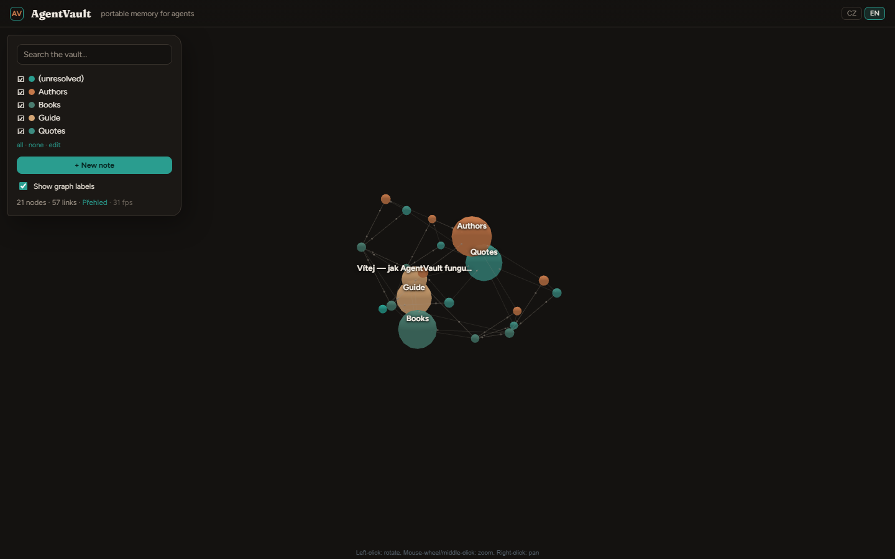

# AgentVault

Local Markdown vault with semantic search for people and AI agents.

Notes stay plain files on disk. PostgreSQL + pgvector is only a rebuildable
index. Agents query it over MCP (`vault_search`, `vault_get`, `vault_neighbors`)
or a small CLI; there is also a local web UI for browsing and editing.

```
./notes/*.md  →  embed + index  →  CLI / MCP / web UI
```

## Why

Agents work better with *your* notes, not only generic web knowledge. Keep the
source portable (git, Obsidian, zip). Throw away the database anytime and run
`./av index` again.

Default embeddings: [BGE-M3](https://huggingface.co/BAAI/bge-m3) (solid for Czech
and many other languages). On a small VPS you can switch to a lighter model in
`.env`.

## Install

```bash
git clone https://github.com/tereza-vac/AgentVault.git
cd AgentVault
./install.sh
```

Then:

```bash
./av index          # index Markdown under NOTES_DIR (default ./notes)
./av web            # http://127.0.0.1:8787
./av serve          # MCP on http://127.0.0.1:8788/mcp
```

Demo with the bundled samples:

```bash
NOTES_DIR=./sample_notes ./av index
NOTES_DIR=./sample_notes ./av web
```

Postgres: `docker compose up -d` (see `docker-compose.yml`). Copy `.env.example`
to `.env` before the first run.

## Web UI



Graph of `[[wikilinks]]`, categories, editor, and semantic search. Bind to
`127.0.0.1` unless you put auth in front (`WEB_AUTH=user:pass`).

## Portability

| Layer | Role | Move elsewhere? |
|---|---|---|
| `NOTES_DIR` Markdown | source of truth | yes |
| Postgres + embeddings | search index | no — rebuild |

More in [docs/PORTABILITY.md](docs/PORTABILITY.md).

## Notion

Use Notion for shared human pages. Keep the agent brain as Markdown here; promote
a summary to Notion only when a project needs it.

## Development

```bash
python3 -m venv .venv
.venv/bin/pip install -r requirements-dev.txt
.venv/bin/pytest
```

## Related

[AgentBridge](https://github.com/tereza-vac/AgentBridge) · [AgentMaison](https://github.com/tereza-vac/AgentMaison)

## License

MIT — [LICENSE](LICENSE), [NOTICE](NOTICE).

Author: [Tereza Vačina](https://github.com/tereza-vac)
